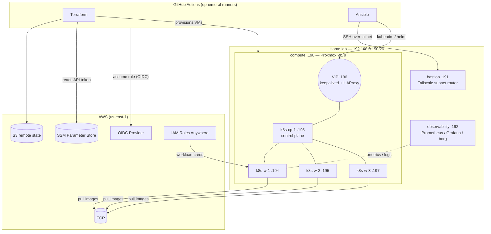

# bvault-infra

Infrastructure-as-Code for the BeatVault platform. This repository turns two bare-metal
machines into a highly-available, GitOps-managed Kubernetes cluster — provisioned by
Terraform, configured by Ansible, and driven end-to-end from GitHub Actions with no
long-lived credentials anywhere in the pipeline.

Everything here is reproducible. The cluster can be destroyed and rebuilt from an empty
Proxmox host by running three workflows in order. There are no snowflake servers and no
manual `kubectl apply` steps once the bootstrap is done.

```
Terraform  →  provisions VMs on Proxmox, emits a dynamic Ansible inventory
Ansible    →  installs a kubeadm HA cluster, storage, networking, ArgoCD
ArgoCD     →  takes over and syncs every workload from bvault-manifests
```

---

## Platform at a glance

| Layer | Technology |
|-------|-----------|
| Hypervisor | Proxmox VE 9 (unattended install via `answer.toml`) |
| Bastion / edge | Debian 13 (unattended install via preseed), Tailscale subnet router |
| Provisioning | Terraform (`bpg/proxmox`), S3 remote state with native lockfile |
| Configuration | Ansible (6 roles), kubeadm |
| Cluster | 1 control plane + 3 workers, HA API via keepalived VIP + HAProxy |
| CNI | Calico (VXLAN, dedicated pod CIDR `10.200.0.0/16`) |
| Block storage | Longhorn (3-replica) for Postgres |
| Bulk storage | ZFS pool exported over NFS, sanoid snapshots |
| GitOps | ArgoCD (core mode, app-of-apps) → [bvault-manifests](https://github.com/xilver1/bvault-manifests) |
| Secrets | AWS SSM Parameter Store + IAM Roles Anywhere + External Secrets Operator |
| Identity | GitHub OIDC federation to AWS — zero static access keys |
| Networking | Tailscale tailnet, GitOps-managed ACLs |
| Observability | Prometheus (remote-write), Grafana, Loki + Alloy, borg backups |

---

## Architecture



The GitHub runner never has a persistent foothold in the lab. It joins the tailnet for the
duration of a job as an ephemeral, tagged node, does its work over SSH and the Proxmox /
Kubernetes APIs, and disappears.

---

## The bootstrap journey

The design principle is a hard line between *manual once* and *automated forever*. Getting
the very first host onto the network needs a human with a USB stick; everything after that
is a workflow dispatch.

### 1. Bare metal (manual, once per machine)

The two physical hosts are installed unattended. Secrets (SSH public keys, password hashes,
a single-use Tailscale auth key) are pulled from SSM at *render* time and baked into the
installer image, so nothing sensitive is typed by hand or committed to git.

- **bastion** — Debian netinst repacked with a rendered `preseed.cfg`. The `late_command`
  installs Tailscale, writes hardened `sshd` config and authorized keys, and drops a oneshot
  service that registers the node as a **subnet router** advertising the lab block into the
  tailnet. From this point the bastion is reachable by CI and the manual phase is over.
- **compute** — Proxmox VE 9 installed from an ISO repacked with a rendered `answer.toml`
  (via `proxmox-auto-install-assistant`), carrying network config, root password, disk
  layout and authorized keys.

See [`guide.md`](guide.md) and [`iso/`](iso) for the exact render-and-burn steps.

### 2. Host configuration (`Setup server fleet` workflow)

`ansible/playbooks/compute-setup.yaml` prepares Proxmox for Terraform. The hard part is
**bootstrapping API authentication** — the native `community.proxmox` modules need an API
token to exist, which is precisely what we are creating. The role solves the chicken-and-egg
with `pveum` over root SSH, and uses a self-healing *show-once secret* pattern:

- Roles, the `terraform@pve` user and its ACLs are created idempotently.
- The API token is **regenerated unconditionally** on every run, then written to SSM. This
  means a half-failed run (token exists in Proxmox but nothing usable in SSM) heals itself
  on the next apply instead of wedging permanently.

The same role also stands up the ZFS `music-pool`, exports it over NFS to the cluster
subnet, and configures sanoid snapshots.

### 3. Cluster (`Setup kubernetes cluster` workflow)

`terraform/` provisions the four VMs with `for_each`, carrying a `role` field so control-plane
and worker nodes split into the right inventory groups. The workflow then converts
`terraform output` into a dynamic Ansible inventory with `jq`:

```bash
terraform output -json k8s_host_data | jq '{ k8s_cluster: { children: {
  control_plane: { hosts: ... }, workers: { hosts: ... } } } }' > ansible/inventory/k8s.yaml
```

Ansible then builds the cluster with `kubeadm`, installs Calico, Longhorn and the
observability agents, and finally hands off to ArgoCD.

---

## What the Ansible roles do

| Role | Responsibility |
|------|----------------|
| `proxmox` | Post-install hardening, ZFS + NFS, sanoid, and the Terraform API-token bootstrap |
| `k8s` | Common node prep for every cluster member — kernel modules, sysctls, containerd (SystemdCgroup), kubeadm/kubelet/kubectl pinned to v1.36 |
| `k8s-control` | keepalived + HAProxy HA endpoint, `kubeadm init`, Calico via Helm, observability agents |
| `k8s-workers` | `open-iscsi` for Longhorn, join nodes to the cluster |
| `argocd` | Install ArgoCD (core mode), create the `AppProject` and the app-of-apps root application |
| `observability` | Prometheus, Grafana, Loki/Alloy and borg on the dedicated observability box |

A few of the sharper edges these roles handle:

- **Calico on Proxmox** requires `cpu { type = "host" }` on the VMs — the default `kvm64`
  model omits `x86-64-v2` instructions and the operator crashes on start. The pod CIDR is
  deliberately `10.200.0.0/16`, kept off the `192.168.0.0/16` LAN so VXLAN-encapsulated pod
  traffic never collides with real addresses.
- **VIP bind race** — `net.ipv4.ip_nonlocal_bind=1` lets HAProxy bind the VIP before
  keepalived has associated it with the interface.
- **br_netfilter** is loaded *before* the bridge sysctls are set, because the keys don't
  exist until the module is present.
- **Calico CRDs** are applied server-side before the operator chart, which does not install
  its own CRDs.

---

## Security model

There are **no static AWS access keys** in this repository or in GitHub secrets. Every
workflow authenticates to AWS through GitHub's OIDC provider and assumes a purpose-scoped
role, with responsibilities deliberately separated:

| Role | Used by | Scope |
|------|---------|-------|
| `lab-infra-ci` | Ansible workflows | SSM reads, host configuration |
| `lab-infra-terraform` | Terraform workflow | State bucket, VM provisioning inputs |
| `lab-infra-acl` | ACL sync (gated on a GitHub Environment) | Tailscale policy OAuth creds only |
| `lab-builder` | image builds (in bvault-app) | ECR push |
| `lab-k8s-workload` | runtime pods via Roles Anywhere | SSM reads for secrets |

The OIDC trust policy binds each role to this repository's own subject claim, so a fork or a
PR from another repo cannot assume it. Tailscale access is likewise least-privilege: the CI
tag is granted only TCP `22`, `8006` and `8443` to the two lab subnets, and the tailnet ACL
itself is **managed as code** — [`tailscale/policy.hujson`](tailscale/policy.hujson) is the
source of truth and the `Sync Tailscale ACLs` workflow applies it on merge to `main`.

---

## Repository layout

```
bvault-infra/
├── terraform/
│   ├── providers.tf              # S3 backend (native lockfile), ephemeral SSM API token
│   ├── modules/compute/          # Proxmox VMs (for_each), dynamic inventory output
│   └── modules/app-resources/    # ECR repository
├── ansible/
│   ├── inventory/                # static physical hosts + generated k8s.yaml
│   ├── playbooks/                # compute / cluster / argocd / observability
│   └── roles/                    # proxmox, k8s, k8s-control, k8s-workers, argocd, observability
├── iso/                          # preseed + answer.toml templates and image builders
├── tailscale/policy.hujson       # tailnet ACL, applied by GitOps
├── aws/                          # OIDC trust + permissions policy references
└── guide.md                      # end-to-end operator runbook
```

## Running it

The three `workflow_dispatch` pipelines, in order:

1. **Setup server fleet** — prepares Proxmox and registers the Terraform API token in SSM.
2. **Setup kubernetes cluster** — Terraform provisions the VMs, Ansible builds the cluster,
   ArgoCD is installed and the root app is created.
3. **Setup observability and backups box** — configures the monitoring host.

Once step 2 finishes, ArgoCD owns the cluster. Application changes ship by committing to
[bvault-manifests](https://github.com/xilver1/bvault-manifests), never by touching the
cluster directly.